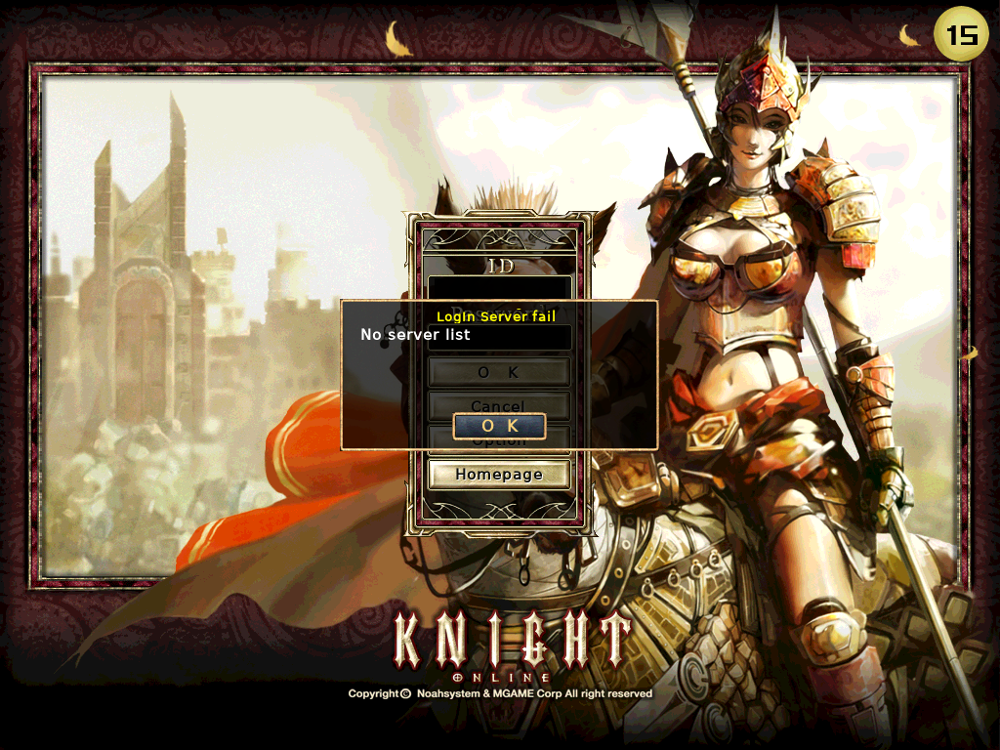
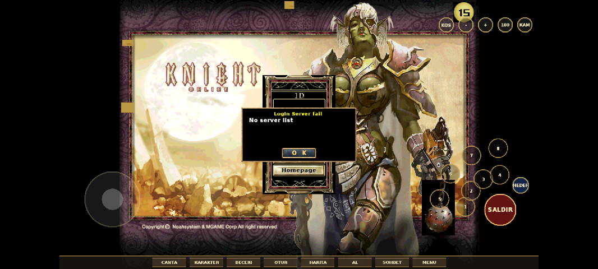

# Knight Online Mobile (OpenKO 1.298 tabanlı port)

Bu dizin, açık kaynak **OpenKO** (Knight Online 1.298, MIT lisansı) istemcisini
Android/Linux'ta **birebir aynı oyun koduyla** çalıştırmak için yapılan portu içerir.
Oyun mantığı, arayüz (UIF), dosya formatları ve ağ protokolü OpenKO ile aynıdır;
yalnızca Windows'a özgü katmanlar (DirectX 9, Win32, DirectInput, Winsock, GDI) değiştirildi.



## Durum

| Parça | Durum |
|---|---|
| `d3d9gles/` DirectX 9 → OpenGL ES 3.0 katmanı | Çalışıyor. Sabit işlev boru hattı (köşe aydınlatması, 8 ışık, sis, doku aşamaları, alfa testi), DXT1/3/5 (donanım yoksa CPU çözücü), A8R8G8B8/A4R4G4B4/A1R5G5B5/R5G6B5, köşe/indeks tamponları, mip üretimi. Başsız piksel testleri geçiyor. |
| `compat/win32/` Win32 uyumluluk | Çalışıyor: tipler, RECT/POINT, zamanlayıcılar, kayıt defteri (dosya), INI, `_findfirst`, Winsock (`WSAAsyncSelect` → `poll`), yol çözümleme (`\` ve harf duyarsızlık). |
| `engine-port/` N3Base taşınan parçalar | FreeType yazı tipi, SHA-1/RC4 doku şifresi, SDL metin girişi, POSIX mmap dosya okuyucu, OpenGL ekran görüntüsü. |
| `platform/` SDL2 kabuğu | WinMain/WndProc yerine SDL olay döngüsü; klavye (DIK eşlemesi), fare, dokunmatik (tek parmak = sol tık, iki parmak = sağ tık), tekerlek, odak, soket olayları. |
| Linux (x86_64) derleme ve çalıştırma | **Login ekranı çiziliyor** (yukarıdaki görüntü, 1.298 istemci verileriyle, başsız Mesa üzerinde). Sunucuya bağlanma kodu değişmedi; OpenKO sunucusu ile test edilmedi. |
| `android/` Gradle projesi | Yazıldı, **henüz derlenmedi** (bu ortamda Android SDK/NDK yok). İlk Android derlemesinde CMake/bağımlılık ayarı gerekebilir. |
| Dokunmatik oyun arayüzü (`platform/KoTouchOverlay`) | Yazıldı (KO Mobile düzeni): yüzen joystick, SALDIR + 8 beceri yuvası + HEDEF, kamera kümesi, alt menü çubuğu, dokunuş = sol tık, sürükleme = kamera, iki parmak = yakınlaştırma. Cihazda henüz denenmedi. |
| Ekran ölçekleme | Telefonlarda oyun 1366x768 (16:9) veya 1024x768 (4:3) mantıksal çözünürlükte çizilir, ekrana en-boy oranı korunarak yerleştirilir (yanlarda bant). `[Mobile] LogicalHeight`, `D3D9GLES_STRETCH=1`. |
| GitHub Actions (`.github/workflows/build.yml`) | Linux derleme + testler geçiyor; Android APK işi üzerinde çalışılıyor (artifact olarak APK üretir). |
| Ses (OpenAL) | Derleniyor; cihazda test edilmedi. |
| BMP/JPG/TGA doku yükleme (`D3DXCreateTextureFromFileEx`) | Yapılmadı (oyun dokuları `.DXT`, nadiren gerekir). |
| Korece metin (CP949) | Linux'ta iconv ile; Android'de yalnızca ASCII (1.298 US verileri İngilizce). |



## Dizin yapısı

```
mobile/
  openko/        Open-KO/KnightOnline (git subtree, MIT) — küçük #ifdef yamalarıyla
  d3d9gles/      Direct3D 9 API'sinin OpenGL ES 3 uygulaması (+ tests/smoke_test.cpp)
  compat/win32/  windows.h, dinput.h, winsock2.h, wincrypt.h ... uyumluluk başlıkları
  engine-port/   DFont_ft.cpp, WinCrypt_portable.cpp, N3UIEdit_portable.cpp, FileReader_posix.cpp, JpegFile_portable.cpp
  platform/      main_sdl.cpp, LocalInput_sdl.cpp, KoPlatformInput.cpp
  android/       Gradle + CMake Android projesi (SDLActivity türevi)
  cmake/deps.cmake  masaüstünde pkg-config, Android'de FetchContent
```

## Linux'ta derleme ve çalıştırma

Gerekli paketler (Ubuntu 24.04):

```
sudo apt install build-essential cmake ninja-build pkg-config libgles-dev libegl-dev libsdl2-dev \
     libfreetype-dev libopenal-dev libmpg123-dev libjpeg-dev libspdlog-dev libfmt-dev
```

Derleme:

```
cd mobile
cmake -S . -B build -G Ninja -DCMAKE_BUILD_TYPE=Release
ninja -C build
ctest --test-dir build        # d3d9gles ve şifre testleri
```

İstemci verileri (1.298 US, ~1.1 GB):

```
git clone --depth 1 -b openko-1298 https://github.com/Open-KO/ko-client-assets.git assets
cp assets/Server.ini.default assets/Server.ini   # IP0=sunucu adresi
```

Çalıştırma:

```
KO_CLIENT_DIR=/yol/assets ./build/KnightOnLine
```

Başsız doğrulama (ekran yok, Mesa yazılım çizici):

```
SDL_VIDEODRIVER=offscreen EGL_PLATFORM=surfaceless LIBGL_ALWAYS_SOFTWARE=1 \
KO_CLIENT_DIR=/yol/assets KO_MAX_FRAMES=20 KO_SCREENSHOT=/tmp/shot.ppm ./build/KnightOnLine
```

Ortam değişkenleri: `KO_INPUT_DEBUG=1` (ya da `Option.ini` `[Mobile] InputDebug=1`): dokunma ve metin
giriş olaylarını stderr/logcat'e yazar (`[ko-input] ...`). `KO_CLIENT_DIR` (veri dizini), `KO_FONT_PATH` (TTF; yoksa `<veri>/fonts/default.ttf`
veya sistem yazı tipi), `KO_MAX_FRAMES`, `KO_SCREENSHOT` (mantıksal), `KO_SCREENSHOT_PHYSICAL` (bantlar dahil),
`KO_TOUCH=1` (masaüstünde dokunmatik kaplama), `KO_TOUCH_DEBUG=1` (kaplamayı login'de de çiz),
`KO_LOGICAL_HEIGHT=768` (telefon ölçeklemesini masaüstünde dene), `D3D9GLES_NO_S3TC=1`, `D3D9GLES_STRETCH=1`.

`Option.ini` içinde `[Mobile]` bölümü: `LogicalHeight=768` (0 = ölçekleme yok), `TouchControls=1`.

Not: Oyunun arayüzü 1024x768, 1280x1024, 1366x768, 1600x1200 ve 1920x1080 için tasarlanmış;
başka çözünürlüklerde login arka planı eksik/bozuk çıkar. Bu yüzden mobilde mantıksal çözünürlük
bu listeden seçilir ve ekrana ölçeklenir.

## Android

`android/` Gradle projesi SDL'in `SDLActivity`'sini kullanır; yerel kod `libKnightOnLine.so` olarak
derlenir (`mobile/CMakeLists.txt`, `ANDROID` dalı). Bağımlılıklar `cmake/deps.cmake` içinde
FetchContent ile çekilir (SDL2 2.30, openal-soft, mpg123, libjpeg, FreeType, spdlog).

```
cd mobile/android
./gradlew assembleDebug       # Android Studio / SDK + NDK r27 gerekir
adb install -r app/build/outputs/apk/debug/app-debug.apk
```

Debug APK depodaki sabit `debug.keystore` ile imzalanır; böylece her CI derlemesi bir öncekinin
üzerine kurulabilir (farklı anahtar → `INSTALL_FAILED_UPDATE_INCOMPATIBLE`).

### Launcher (LauncherActivity)

Uygulama PC'deki KO Launcher gibi tam ekran yatay bir başlatıcıyla açılır: arka plan (veri dizinine
`launcher_bg.png/jpg` konursa o kullanılır), haberler (VersionManager `LS_NEWS`, sunucudaki
`Version.ini [NEWS]`), sunucu durumu (`LS_SERVERLIST`: çevrimiçi/dolu + oyuncu sayısı), sürüm etiketi
(veri sürümü = `Server.ini [Version] Files`, APK sürümü), tek ilerleme çubuğu (yüzde, MB, hız, kalan
süre) ve **OYUNA BAŞLA**. Açılış sırası:

1. **APK güncellemesi**: `apk.json` bildirimi (varsayılan `http://86.105.4.195/ko/mobile/apk.json`,
   Ayarlar'dan değişir) okunur; `versionCode` kurulu olandan büyükse sorulur, APK kaldığı yerden
   devam eden indiriciyle önbelleğe alınır, `sha256` doğrulanır ve paket yükleyicisi açılır
   (Android 8+ "bilinmeyen uygulama" izni istenir). CI her derlemede artifact içine
   `KnightOnline.apk` + `apk.json` koyar; ikisi sunucuda aynı dizine kopyalanır.
   CI'da `versionCode = 100 + GITHUB_RUN_NUMBER`, `versionName = 0.1.<no>+<commit>`
   (`KO_VERSION_CODE`/`KO_VERSION_NAME`); yerel derlemede git commit sayısı.
2. **Veri kurulumu** (ilk sefer / "Veriyi onar"): adresten ya da seçilen zip'ten.
3. **Veri yaması**: `PatchClient` (aşağıda).
4. Hazır → OYUNA BAŞLA. "Ayarlar": sunucu IP, protokol (1.298/2369) ve portlar (Server.ini), veri/APK adresleri, dokunmatik kontroller,
   mantıksal yükseklik, girdi hata ayıklama (Option.ini `[Mobile]`).

### Sunucu protokolü: 1.298 (OpenKO) ve 2369 (ISTIRAP)

İstemci iki sunucu protokolüyle konuşabilir; seçim çalışma zamanında `Server.ini`'den okunur
(`KoProtocol.h`, hem yerel kod hem Launcher aynı kuralı uygular):

```ini
[Server]
Count=1
IP0=86.105.4.195
Protocol=2369     ; yoksa [Version] Files >= 2000 ise 2369, değilse 1298
LoginPort=15200   ; yoksa protokole göre 15200 / 15100
GamePort=15301    ; yoksa protokole göre 15301 / 15001
```

Launcher Ayarlar'ında "Sunucu protokolü" (1.298 / 2369), giriş/oyun portu ve veri adresi vardır;
2369 seçilince varsayılan veri adresi `http://86.105.4.195/ko/client2369.zip` olur (~3 GB,
14.115 dosya, `Files=2434`). Sunucu durumu/yama sorguları (`LS_SERVERLIST`, `LS_VERSION_REQ`,
`LS_DOWNLOADINFO_REQ`, `LS_NEWS`) protokole göre ayrıştırılır.

2369 düzenleri depodaki `1 - Login & Game Source` sunucu kaynağından türetildi (`__VERSION 2369`,
şifreleme yok, anti-cheat sunucuda zorunlu değil). Aşama 1'de uygulanan paketler:

| Paket | 2369 farkı |
|---|---|
| `LS_SERVERLIST` | istek `uint16 echo`; yanıt lanIP/IP/ad, kullanıcı, sunucu/grup ID, kapasite, ekran tipi, 4 kral/duyuru dizgesi |
| `LS_LOGIN_REQ` | `uint16 0` + sonuç (1 başarı, 2 hesap yok, 3 şifre, 4 yasaklı, 5 oyunda, 0xF sözleşme, 0x10 OTP) |
| `WIZ_VERSION_CHECK` | `uint8, uint16 sürüm, uint8, uint64, uint64, uint8`; sürüm 2369 ile karşılaştırılır |
| `WIZ_COMPRESS_PACKET` | başlık `uint32 × 3` (1298: `uint16, uint16, uint32`) |
| `WIZ_ALLCHAR_INFO_REQ` | istek alt opcode 1; yanıt 4 karakter, `uint32` saç (arayüzde 3 yuva gösterilir) |
| `WIZ_SEL_CHAR` | zoneCur baytı gönderilmez |
| `WIZ_GAMESTART` | adımlar 1/2 + karakter adı (`uint8` uzunluk) |
| `WIZ_MYINFO` | genişletilmiş düzen: `int64` exp, klan/pelerin bloğu, 75 envanter yuvası, premium/manner/rebirth kuyruğu |
| `WIZ_USER_INOUT` / `WIZ_REQ_USERIN` | `uint16` tür; `uint32` saç, abnormal, yön, 15 eşya yuvası; REQ_USERIN kayıtları önünde `uint8 0` |
| `WIZ_REGIONCHANGE` | alt opcode 0/1/2; liste yalnız 1'de |
| `WIZ_NPC_INOUT` / `WIZ_REQ_NPCIN` | ad paket içinde yok (görünüm tablosundaki model adı kullanılır); `int16` yön; tür 3/4 = giriş |
| `WIZ_NPC_MOVE` | önde `uint8 1` |
| `WIZ_MOVE` | gönderimde mevcut konum eklenir; echo 0 dur / 1 başla / 3 devam |
| `WIZ_CHAT` | ChatType → N3 sohbet kipi eşlemesi (`MapChatType2369`) |
| `WIZ_NOTICE` | biçim 1 (eski), 2 (başlık+mesaj çiftleri), 4 (sağ üst başlık iletisi) |
| `WIZ_ZONE_CHANGE` | ışınlanma: `uint16` bölge, x, z, y, ulus, eski zafer |

**2369 veri tabloları:** `client2369.zip` içindeki 243 `.tbl` dosyasının 233'ü çift katman şifreli
(klasik XOR katmanı + 8 baytlık bloklarla çalışan ikinci bir şifre; XOR sonrası sabit 16 bayt önek
`44 29 ae 6e …`, boyut % 8 == 4). İstemci XOR sonrası başlığı denetler, ikinci katmanı tanır ve Log.txt'ye
yazar (`N3TableBaseImpl.cpp`: `KoTableHeaderLooksValid` / `KoTableLayer2Decrypt`); çözücü
`Knightonline.exe` analiziyle eklenecek. Temel tablolar (Texts/UIs/Zones) okunamazsa oyun siyah ekran
yerine açıklayıcı bir hata kutusu gösterip kapanır. PC'de inceleme için `scripts/tbl_tool.py info <Data>`
(XOR katmanı + başlık denetimi + katman-2 tespiti) ve `dump <tbl>`.

`ko_proto_test` (CTest) sunucu kaynağındaki `Packet <<` sırasını taklit eden paketlerle bu ayrıştırıcıları
ve gönderilen paket yapıcılarını doğrular. Sonraki aşamalar: savaş/eşya/yükseltme, klan/kral/PUS,
2369 arayüzü, 2369 veri uyumluluğu (bölge numaraları, `UI` klasörü, NPC ad tablosu).

### Oyun verisini telefona kurma

Launcher oyun verisini arar; yoksa "Veriyi indir ve kur" (varsayılan adres) ya da "Veriyi onar /
yeniden kur" menüsünden zip seçimi sunar:

1. **Zip dosyası seç**: istemci klasörünü (`UI/`, `Data/`, `Misc/`, `Server.ini`, `Option.ini`, ...)
   tek bir `.zip` yapıp telefona atın (Download klasörü yeterli) ve seçin. Zip tek bir üst klasörle
   paketlenmişse içeriği otomatik kök dizine taşınır.
2. **Adresten indir**: aynı zip'in `http(s)://` adresini yazın; akış doğrudan veri dizinine açılır.
   Alan varsayılan olarak `http://86.105.4.195/knightonline-mobile.zip` ile gelir
   (`GameData.DEFAULT_DATA_URL`). Bağlantı koparsa `ResumingHttpStream` kaldığı bayttan
   `Range` isteğiyle yeniden bağlanır (30 denemeye kadar, üstel bekleme); sunucu `Range`
   desteklemiyorsa eksik baytlar okunup atılır. Ekranda yüzde, alınan/toplam MB, hız ve kalan süre
   gösterilir; indirme boyunca ekran açık tutulur.

Kurulumdan sonra ve her oyun başlatılışında `Server.ini` denetlenir: dosya yoksa yazılır, `[Server]`
altında `IP0` yok ya da `127.0.0.1`/boş ise `IP0=86.105.4.195` (`GameData.DEFAULT_SERVER_IP`) yapılır.
Elle başka bir adres yazılmışsa dokunulmaz.

Veri dizini `Android/data/online.knight.mobile/files/` (yoksa `/data/data/online.knight.mobile/files/`),
oyuna `--client-dir` argümanıyla iletilir. Android 11+ sürümlerinde `adb push` ile buraya atılan
dosyaların sahibi `shell` olduğundan oyun bunları okuyamaz; o yüzden veri uygulamanın kendisi
tarafından açılır. Root'suz cihazda adb ile hızlı yükleme (debug APK, `run-as` ile):

```
adb push ko-assets.zip /data/local/tmp/ko.zip
adb shell run-as online.knight.mobile sh -c 'mkdir -p files && cd files && unzip -o /data/local/tmp/ko.zip'
# unzip yoksa: tar ile paketleyip  run-as online.knight.mobile tar -xf /data/local/tmp/ko.tar -C files
```

Yazı tipi için `<veri>/fonts/default.ttf` koyun (yoksa `/system/fonts/` denenir).

### Tanılama ve performans seçenekleri

- Launcher'da **Hata raporu gönder**: `Log.txt`, `gpu.txt` (GL_VENDOR/RENDERER/VERSION, S3TC, sınırlar,
  GL_EXTENSIONS), `Server.ini`, `Option.ini`, son logcat (yalnız uygulamanın kayıtları) ve cihaz
  bilgisi tek zip'te, Android paylaşım menüsüyle.
- `Log.txt`'ye düşenler: `[gpu] ...` aygıt bilgisi, `[d3d9gles] ...` (GL hataları `glGetError` ile doku
  yüklemede ve her kare sonunda; desteklenmeyen doku formatı; FBO/ölçek), `[dosya yok] <yol>`
  (okunamayan her dosya, yol başına bir kez).
- `Option.ini [Mobile]`: `ShowFps=1` (sol üstte FPS/çözünürlük/ölçek), `RenderScale=50|75|100`
  (3D sahne mantıksal çözünürlüğün yüzdesi kadar FBO'ya çizilir, UI keskinliği değişmez),
  `[Shadow] Use`, `[Texture] LOD_*` (düşük doku kalitesi). Hepsi launcher Ayarlar'da.
  Ortam: `KO_SHOW_FPS`, `KO_RENDER_SCALE`.

### Dokunmatik kontroller (oyun içi)

- Sol yarı: parmağın bastığı yerde beliren joystick (W/S ileri-geri, A/D dönüş; ölü bölge
  `JoyDeadZone`). Serbest alanda sürükleme: kamera (sağ tuş sürüklemesi, hız `CameraSens`);
  iki parmak: yakınlaştırma.
- Tek dokunuş = sol tık (yürü / hedef seç / arayüz). 3D dünyada çift dokunuş = oyunun çift tıkı
  = hedefe saldır; uzun basış (`LongPressMs`, varsayılan 450 ms) = sağ tık: NPC ile konuş,
  ceset/kutu aç, kapı/nesne olayı.
- Arayüz pencereleri üstünde (çanta, beceri, skill bar, ticaret, depo, pazar, ekipman):
  sürükleme = sol tuş sürüklemesi (ikon taşıma, pencere taşıma, kaydırma çubuğu; LBCLICK ve ilk
  LBDOWN ikonun üstünde iki kare tutulur); uzun basış = ikonu tut, parmak kıpırdamadan kalkarsa
  **yapışkan taşıma** (ipucu çıkar, sonraki dokunuş ikonu oraya bırakır); çift dokunuş = sağ tık
  (eşya kullan / giy, beceri kullan). Sayılabilir eşyalar ticaret/depo/pazarda bırakılınca oyunun
  kendi adet penceresi açılır (klavye otomatik gelir).
- Sağ alt: SALDIR (R), HEDEF (Z), PARTI (X), DOST (V), NPC (B), 2×4 beceri ızgarası (1-8), üstünde F1..F8
  sayfa düğmeleri (seçili sayfa vurgulu), HP/MP pot düğmeleri (`PotHpSlot`/`PotMpSlot`). Joystick üstünde
  OTO (E, sürekli yürüme). Sağ üst: kamera kümesi (F9, 180°, +/-, T koş). Alt çubuk: Çanta (I),
  Karakter (U), Beceri (K), Otur (C), Harita (M), Al (F), Sohbet (Enter → klavye açılır, Enter
  gönderir), Menü (H komut listesi), Yardım (F10), Kapat (ESC).
- `ko_touch_test` (ctest): parmak olayı → kaplama → CLocalInput zincirini başsız doğrular.
- Düğme boyutu fiziksel DPI'dan hesaplanır (en az ~48dp). `UiScale=125|150` oyun içi mantıksal
  yüksekliği 768/ölçek yapar (arayüz pencereleri ve yazılar büyür); giriş/karakter ekranları 768'de
  kalır. Hepsi launcher Ayarlar'da.

### Ekran klavyesi

SDL 2.30 metin girişini açılışta "aktif" bırakır (klavye göstermeden); bu yüzden `SDL_IsTextInputActive()`
ile koşullanan `SDL_StartTextInput` hiç çalışmıyor ve telefonda klavye açılmıyordu. Pencere
oluşturulunca bir kez `SDL_StopTextInput()` çağrılır; bir edit odak kazandığında koşulsuz
`SDL_SetTextInputRect` (kutunun ekrandaki yeri) + `SDL_StartTextInput` yapılır, odak gidince 15 kare
sonra kapatılır. `SDL_HINT_ENABLE_SCREEN_KEYBOARD=1`, oyun etkinliğinde `windowSoftInputMode=adjustPan`.

## Nasıl çalışıyor (kısa)

- Oyun motoru `s_lpD3DDev->SetRenderState(...)`, `DrawPrimitiveUP(...)` gibi D3D9 çağrıları yapar.
  `d3d9gles` bu çağrıları olduğu gibi alır, durumu izler ve her çizimde durum anahtarına göre
  üretilen GLSL ES 3.00 programıyla OpenGL ES'te çizer. D3D'nin saat yönü ön yüz, sol el koordinat,
  `[0,1]` derinlik ve piksel merkezi kuralları shader/GL durumunda birebir karşılanır.
- `.DXT` dokular (v7) RC4 ile şifreli; `WinCrypt_portable.cpp` CryptoAPI'nin `CryptDeriveKey`
  türetimini (SHA-1 ilk 16 bayt) ve her parçada sıfırlanan RC4 akışını aynen uygular.
- Dosya adları oyunda küçük harf ve `\` ile gelir; `KoResolvePath` gerçek dosyayı harf duyarsız bulur.

## Yol haritası

1. Android'de ilk derleme ve cihazda login ekranı.
2. OpenKO sunucusu (Ebenezer/Aujard) ile giriş, karakter seçimi, Moradon'a giriş testi.
   2369: ISTIRAP sunucusu (86.105.4.195:15200/15301) ile aynı akış; veri `client2369.zip`.
3. Dokunmatik oyun arayüzü: sanal joystick, hedef seçme, beceri çubuğu, sohbet için sanal klavye.
4. Performans: shader/uniform önbelleği, doku belleği (CPU gölge kopyalarını serbest bırakma), ETC2/ASTC doku ön dönüşümü.
5. Ses testleri, BMP/JPG doku yükleme, iOS (aynı kod + SDL iOS projesi).
